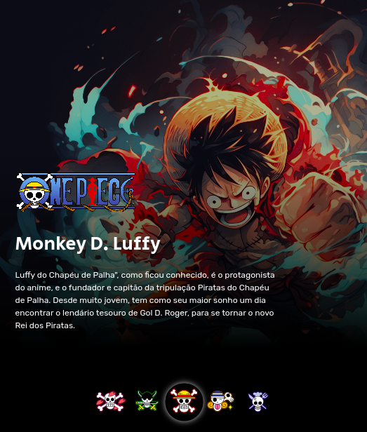

<!-- 

  

   -->

## 🖥️ Projeto
Esse é um projeto web Responsivo para selecionar e exibir personagens do anime 'One Piece'.

## 🚀 Tecnologias
Esse projeto foi desenvolvido durante a SZPC do Dev em Dobro com as seguintes tecnologias: 

- HTML
- CSS
- JS
- Git e Github

